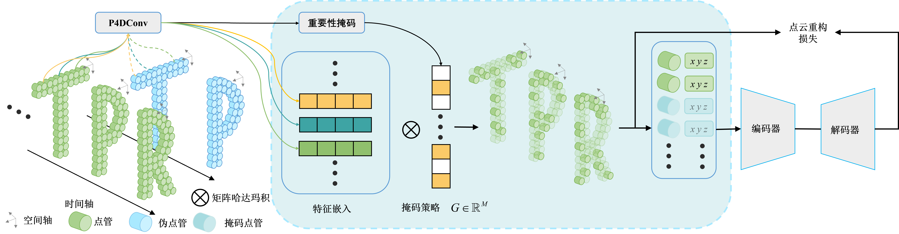

# 基于掩码自监督的点云动作识别算法 
#   Point Cloud Action Recognition Method Based on Masked Self-supervised Learning

##  Introudction
The Masked Spatio-Temporal Dynamic Transformer (MSTD-Transformer) model proposed in this work is a method for point cloud action recognition. The approach in this paper is divided into two stages: pre-training and fine-tuning. In the pre-training stage, an importance masking strategy is used to mask point cloud videos, and a dual-stream self-supervised task is employed to reconstruct the point cloud. In the fine-tuning stage, a classification task is performed. The accuracy on the standard dataset MSRAction-3D is 96.17%, which is an improvement of 2.07% compared to existing methods.

<p align="center">

</p>

## Installation

1. Environment:

    - Python 3.8
    - Pytorch 1.8.1
    - CUDA 11.1
    - Ubuntu 18.04


    Compile the CUDA layers for [PointNet++](http://arxiv.org/abs/1706.02413)

    ```
    cd modules
    python setup.py install
    ```
    Initialization l2 Chamfer Loss
    ```
    cd ./extensions/chamfer_dist
    python setup.py install
    ```

2. Dataset preparation:

    - MSRAction-3D :put under `data/processed_data`


## Pre-training

```
python 0-pretraining-msr.py
```
## Fintune

```
python finetune-msr.py
```
The code provides a trained model model.pth that can be directly used.

You need to place the pre-trained model in the directory log_finetune_10%MSR/MSR3D.

## Acknowledgement

PSTNet: https://github.com/hehefan/Point-Spatio-Temporal-Convolution

P4Transformer: https://github.com/hehefan/P4Transformer

PST-Transformer: https://github.com/hehefan/PST-Transformer

MAE: https://github.com/facebookresearch/mae

MaST-Pre:https://github.com/JohnsonSign/MaST-Pre

VideoMS:https://github.com/sunilhoho/VideoMS
